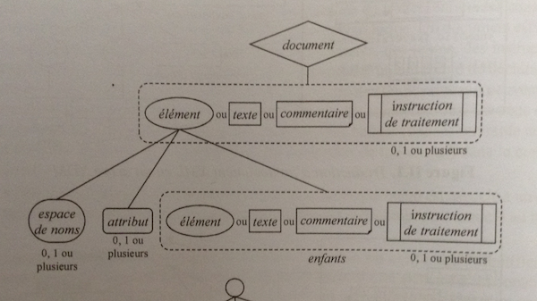
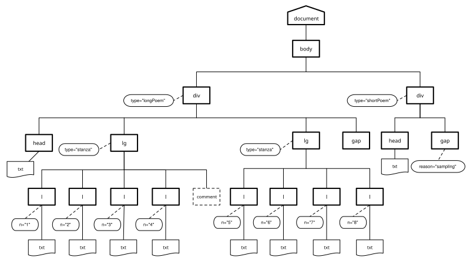
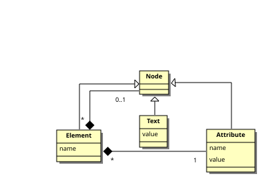

# XPath

<dia-only state="centered">
# 02 | Rafraîchissements XPath</br>
ENS Lyon – septembre 2026
</dia-only>

<dia-both>
>XPath is a language for addressing parts of an XML document, designed to be used by both XSLT and XPointer

>The primary purpose of XPath is to address parts of an XML document.

[XML Path Language 2.0, 2003](http://www.w3.org/TR/xpath20/)
</dia-both>

Comme le suggère cette citation, XPath a d’abord été conçu pour être utilisé au sein de langages dits hôtes ayant besoin d’identifier des portions précises dans un document. On utilise ainsi XPath avec XSLT pour sélectionner des nœuds, extraire des informations, ou encore effectuer des tests.

Les expressions XPath peuvent aussi être utiles pour naviguer précisément dans des documents XML en créant des pointeurs hypertextes sophistiqués dans le contexte du langage XPointer.

Plusieurs utilisations de XPath sont donc possibles
- pour désigner des ensembles de nœuds dans une transformation XSLT ou lors d’une requête XQuery
- pour contrôler la qualité d’un document XML (exploration, analyse, vérification)
- pour paralléliser des textes

<dia-both>
## Historique

- 1999 : première version du langage, immédiatement utilisée par SLT 1.0
- 2007 : seconde version du langage spécifiée en 2007
- 2010 : support des langages XSLT 2.0 et XQuery 1.0 (s’appuie sur XML Data Model publié la même année)[^1]
- 2014 : Version 3 publiée en 2014, puis 3.1 en 2017
- Version 4 en cours

</dia-both>

La première version de XPath a été publiée en 1999 et fut immédiatement utilisée par XSLT 1.0.

XPath est le premier langage de la famille XML à avoir opéré sur un **modèle de données** au sens d’un cadre formel permettant la représentation et la manipulation de données. La description de la version 1.0 de ce langage, publiée en 1999, contient en effet la description d’un modèle de données très simple où un document XML est représenté comme un arbre pouvant être composé de **sept types de nœuds**.

La seconde version du langage, XPath 2.0, a été spécifiée en 2007 et a servi de support aux langages XSLT 2.0 et XQuery 1.0. Cette seconde version de XPath, s’appuie sur le XML Data Model publié en même temps que la spécification XPath 2.0.

## Un langage fonctionnel qui s’appuie sur un modèle de données

Une des caractéristiques essentielles du langage XPath, est qu’il s’appuie sur un modèle de données (XPath/XQuery à partir de la version 2.0) dont la connaissance est essentielle pour une bonne compréhension du langage.

Il s’agit d’un véritable langage fonctionnel typé. Ainsi, l’utilisateur manipule des expressions et non des instructions, et l’évaluation de ces expressions produit des valeurs appartenant à des types définis dans un système de types. La version 2.0 langage intègre le riche système de types de [XML Schema](./nXMLSchema).

Après avoir examiné le modèle de données XML, nous aborderons les diverses expressions XPath et leur types, avant de nous concentrer sur des expressions servant à décrire des chemins pour sélectionner des ensembles de nœuds dans un arbre XML.

<dia-both state="intertitre" bg="#1a1a2e">
# Le modèle de données XML

</dia-both>

<dia-both>
# Les nœuds dans le modèle XDM

- `document node` (nœud document)
- `element node` (nœud élément)
- `attribute node` (nœud attribut)
- `comment node` (nœud commentaire)
- `processing instruction node` (nœud instruction de traitement)
- `text node` (nœud texte)
- `namespace node` (nœud espace de nom)

http://www.w3.org/TR/xpath-datamodel/


</dia-both>

Dans le XML Data Model (XDM) un document est une structure d’arbre qui peut être composée de **sept types de nœuds**. En abordant le modèle de données de XML, on monte en abstraction par rapport à ce que vous savez déjà peut-être de XML. La syntaxe XML décrit en réalité un modèle abstrait à partir duquel on va pouvoir travailler informatiquement.

Ces **nœud** sont les sept types de nœuds définis dans le modèle de données XPath 1.0, à l’exception du nœud racine rebaptisé `document node` au lieu de `root node` :

- `document node` (nœud document)
- `element node` (nœud élément)
- `attribute node` (nœud attribut)
- `comment node` (nœud commentaire)
- `processing instruction node` (nœud instruction de traitement)
- `text node` (nœud texte)
- `namespace node` (nœud espace de nom)

http://www.w3.org/TR/xpath-datamodel/

<dia-both>
## Contraintes des nœuds

Les éléments d’un document XML bien formé répondent à un certain nombre de contraintes



</dia-both>

Les éléments d’un document XML bien formé répondent à plusieurs contraintes :

- un nœud document ne doit pas avoir de nœud père et peut avoir des nœuds fils qui peuvent être des nœuds élément, texte, commentaire, ou instruction de traitement
- un nœud élément peut avoir un nœud père qui doit être un nœud document ou élément et peut avoir des nœuds fils qui doivent être des nœuds espace de noms, attributs, élément, texte, commentaire ou instruction de traitement
- les nœuds fils d’un nœud document ou élément qui sont des nœuds élément, texte, commentaire ou instruction de traitement sont appelés les enfants de ce nœud
- un nœud document ou élément ne doit pas avoir deux enfants consécutifs qui sont des nœuds textes
- un nœud document ou élément ne doit pas avoir d’enfants qui sont des nœuds textes dont le contenu est vide
- un nœud espace de nom ou attribut peut avoir un nœud père qui doit être un nœud élément
- un nœud texte, commentaire ou instruction de traitement peut avoir un nœud père qui doit être un nœud élément ou document


<dia-both>
## Ordre du document

- le nœud racine est le premier nœud après le nœud document
- les nœuds `element` précèdent leurs nœuds fils
- l’ordre relatif des nœuds frères entre eux est déterminé par leur ordre d’apparition dans la représentation balisée
- les nœuds `attribute` et `namespace` précèdent les nœuds fils de cet élément
- les nœuds `namespace` précèdent les nœuds `attribute`
- l’ordre des nœuds `namespace` et `attributs` dépend de l’implantation

</dia-both>

Un document XML (ou un fragment de document) est composé d’une hiérarchie de nœuds. Chaque nœud a une identité et il existe un ordre du document.

Autrement dit, les nœuds qui sont accessibles lors d’une session de travail sont munis d’un ordre, qu’on appelle **ordre du document**. Cet ordre est défini tel que correspondant à l’ordre dans lequel le premier caractère de la représentation XML de chaque nœud apparaît dans le document XML balisé (après expansion des entités générales).

- le nœud racine est le premier nœud element après le nœud document, il contient tous les autres éléments
- les nœuds `element` précèdent leurs nœuds fils
- l’ordre relatif des nœuds frères entre eux est déterminé par leur ordre d’apparition dans la représentation balisée **(autrement dit, les nœuds descendants d’un nœud apparaissent avant le nœud frère)**
- les nœuds `attribute` et `namespace` précèdent les nœuds fils de cet élément
- les nœuds namespace précèdent les nœuds `attribute`
- l’ordre des nœuds `namespace` et `attribute` dépend de l’implantation

Exercice : Produire la représentation arborescente de [phares.tei.xml](./exemplesTEI/phares.tei.xml)

```xml
<?xml version="1.0" encoding="UTF-8"?>
<body xmlns="http://www.tei-c.org/ns/1.0" n="spleenEtIdeal">
  <div type="longPoem">
    <head>Les Phares</head>
    <lg type="stanza">
<l n="1">Rubens, fleuve d’oubli, jardin de la paresse,</l>
<l n="2">Oreiller de chair fraîche où l’on ne peut aimer,</l>
<l n="3">Mais où la vie afflue et s’agite sans cesse,</l>
<l n="4">Comme l’air dans le ciel et la mer dans la mer ;</l>
<!-- nœud commentaire -->
    </lg>
    <lg type="stanza">
<l n="5">Léonard de Vinci, miroir profond et sombre,</l>
<l n="6">Où des anges charmants, avec un doux souris</l>
<l n="7">Tout chargé de mystère, apparaissent à l’ombre</l>
<l n="8">Des glaciers et des pins qui ferment leur pays ;</l>
    </lg>
    <gap reason="sampling" quantity="9" unit="stanza"/>
  </div>
  <div type="shortPoem">
    <head>La Muse malade</head>
    <gap reason="sampling" quantity="4" unit="stanza"/>
  </div>
</body>
```

<dia-both>
## Sérialisation arborescente de [phares.tei.xml](./exemplesTEI/phares.tei.xml)



</dia-both>

On peut décrire la relation hiérarchique entre les nœuds d’un document XML en faisant l’analogie avec une famille.

### Enfant
- Un élément peut avoir zéro, un ou plusieurs autres éléments enfants. Il peut également avoir des enfants texte, commentaire, et instruction de traitement.
- Les attributs ne sont pas considérés comme les enfants d’un élément
- Un nœud document peut avoir un élément fils (celui qui contiendra tous les autres) mais aussi des fils commentaire, ou instruction de traitement.

### Parent
Le parent d’un élément est soit un autre élément soit un nœud document. Le parent d’un attribut est l’élément qui le porte.

Attention ! Même si les attributs ne sont pas considérés comme fils des éléments, les éléments sont les parents des attributs !

### Ancêtre
Les ancêtres sont les nœuds parents, les parents des parents, etc.

### Descendants
Les descendants sont les enfants, petits-enfants, et tous les descendants d’un nœud.

### Sibling
Les siblings d’un nœuds sont les autres enfants de son parent. Les attributs ne sont pas considéré comme des siblings.

<dia-both>
## Les composants du modèle de données XML



</dia-both>

Une autre manière possible de visualiser les différentes composantes définies par le modèle de données XML.

détailler séquence, item, etc.

<!-- background-image: url(../images/xmlSimplifiedXDM.svg) -->

Eric Van der List. Simplified XDM. https://xmllondon.com/2014/slides/vlist/index.html#/step-16 CC-By 4.0

<dia-both>
### Le modèle [XDM](http://www.w3.org/TR/xpath-datamodel/)

#### Les nœuds ont une identité :

Chaque nœud possède une identité unique. On peut avoir deux nœuds avec le même nom et le même contenu dans le document source, mais cela ne signifie pas qu’ils auront la même identité. L’identité est unique pour chaque nœud, elle est affectée par le processeur.

</dia-both>

<dia-both>
### Le modèle [XDM](http://www.w3.org/TR/xpath-datamodel/)

#### Aux nœuds sont attachées différentes propriétés :

- Les éléments et les attributs possèdent un nom.   Ces noms sont accessibles à l’aide des fonctions `node-name()`, `name()`, `local-name()`
- Pour chaque type de nœud, il est possible de déterminer ce que l’on appelle sa **valeur de chaîne** (`string value`) qui correspond schématiquement à son contenu textuel. On peut accéder à la valeur textuelle d’un élément avec la fonction `string()`
- On peut encore extraire d’un nœud sa **valeur typée** (`typed value`), son nom qualifié, etc.

</dia-both>

<dia-both>
### Le modèle [XDM](http://www.w3.org/TR/xpath-datamodel/)

#### identité d’un nœud

Les nœuds ont une identité. Deux nœuds créés par deux expressions différentes sont distincts même s’ils ont le même nom, les mêmes fils, etc.

Chaque nœud possède une identité unique. On peut avoir deux nœuds avec le même nom et le même contenu dans le document source, mais cela ne signifie pas qu’ils auront la même identité. L’identité est unique pour chaque nœud, elle est affectée par le processeur.

</dia-both>

<dia-both>
### Le modèle [XDM](http://www.w3.org/TR/xpath-datamodel/)

#### Aux nœuds sont attachées différentes propriétés :

-  nom
- valeur textuelle
- valeur typée

</dia-both>


En outre, les éléments et les attributs possèdent un nom. Ces noms sont accessibles à l’aide des fonctions `node-name()`, `name()`, `local-name()`

### Valeur textuelle

Par exemple, pour chaque type de nœud, il est possible de déterminer ce que l’on appelle sa valeur de chaîne (`string value`) qui correspond schématiquement à son contenu textuel.

Les nœuds peuvent avoir deux types de valeur, une valeur de chaîne et une valeur typée. Tous les nœuds ont un contenu textuel (string value). La valeur textuelle d’un élément est la concaténation des données caractères de cet élément et de ses descendants.

On peut accéder à la valeur textuelle d’un élément avec la fonction `string()`

On peut encore extraire d’un nœud sa valeur typée (`typed value`), son nom qualifié, etc.

Globalement : se souvenir qu’un nœud possède un nom, et une valeur textuelle à laquelle on pourra accéder à l’aide d’une expression XPath


<dia-both state="intertitre" bg="#1a1a2e">
## Les expressions XPath
</dia-both>

<dia-both>
### Les types d’expressions XPath

XPath permet d’écrire des **expressions de chemin** (*path expressions*) qui permettent de sélectionner des fragments d’un document XML.

Mais les expressions XPath permettent aussi :
- d’effectuer des **calculs** sur le contenu des nœuds sélectionnés,
- d’écrire des **tests** pour sélectionner des nœuds,
- etc.
</dia-both>

<dia-both>
### Évaluation d’une expression XPath

En XPath 2.0, toutes les valeurs manipulées sont des **séquences** (*sequences*).

- Une séquence est une collection ordonnée de zéro ou plusieurs items.
- Un **item** appartenant à une séquence est soit un nœud soit une valeur atomique.

</dia-both>

<dia-both>
### Types XPath

Une valeur atomique est une valeur appartenant à l’espace de valeur d’un **type atomique**.

XPath 2.0 reconnaît comme types atomiques les types atomiques primitifs de [XML Schema](http://www.w3.org/TR/xmlschema-2/), ainsi que plusieurs types qui en dérivent.

La valeur d’une expression XPath 2.0 est toute séquence autorisée par le modèle de données.
</dia-both>

<dia-both>

</dia-both>

<dia-both>
## Le modèle de données XML

Le [modèle de données XML](https://www.w3.org/TR/xpath-datamodel-31/) (*XML Data Model*)
</dia-both>

<!-- @todo ajouter diagrammes -->

<dia-both>
### Exemples

- `12` est une **expression littérale** dénotant une **valeur atomique** de type `xs:integer`

- `15.5` est une **expression littérale** dénotant une **valeur atomique** de type xs:decimal

- `1, 2` est une expression construisant une **séquence** de deux **valeurs atomiques** de type `xs:integer`

- `auteur = "Dupont"` est **expression booléenne** dont la valeur est de type `xs:boolean`

</dia-both>

(En programmation informatique, une **valeur littérale** est une valeur donnée explicitement dans le code source d’un programme)

À partir de XPath 2.0, l’utilisation d’un système de types rigoureux a de nombreux avantages. Il offre notamment la possibilité de détecter des erreurs lors d’une phase d’analyse statique. Mais il peut poser des problèmes de compatibilité avec XPath 1.0, bien qu’ayant été conçu pour être compatible, les modèles de données présentent plusieurs différences notables.

<dia-both>
### Les types définis par le XML Data Model (XDM)

```xquery
'string' (: chaîne de caractères :)
```

```xquery
1 (: entier :)
```

```xquery
1 + 1 + 1 (: somme :)
```

```xquery
1, 2, 3 (: séquence :)
```
</dia-both>

Comme nous venons de le voir, XPath permet d’écrire différents types d’expressions


## Expressions de chemins

Comme nous venons de le voir, XPath permet d’écrire différents types d’expressions (arithmétiques, booléennes, etc.).

- arithmétiques ex. `1 + 2`
- booléennes ex. `true()`
- etc.

Parmi ces expressions, les expressions de chemins (`path expressions`) représentent le cœur de ce langage dans la mesure où elles permettent de **sélectionner une séquence de nœuds** en spécifiant un chemin à suivre à partir d’un point de départ (la racine ou un autre nœud de la structure)

<dia-both>
## Les expressions de chemins

Pour comprendre cette notion de chemin, on peut faire l’analogie avec d’autres structures hiérarchiques comme les systèmes de fichiers Unix où il est nécessaire de pouvoir noter le chemin menant à un fichier ou un groupe de fichiers spécifiques.

Chemin absolu

```bash
	/Users/emmanuelchateau/formENC2014/xpath01.tei.xml
```

Chemin relatif

```bash
	formENC2014/xpath01.tei.xml
```

Par exemple, le système de fichiers, dont la racine a pour nom `/`.
</dia-both>

Dans ce système, un fichier est désigné par un nom qui correspond au chemin (*path*) que l’on doit suivre dans la structure pour atteindre ce fichier.

Le chemin peut partir de la racine, on parle alors d’un chemin absolu. Ou il peut partir d’un autre point du système, on parle dans ce cas d’un chemin relatif, ce chemin est dit relatif car son interprétation dépend de l’endroit où l’on se trouve.

Dans un chemin Unix, chaque pas (ou étape) est séparé par le caractère / qui permet de passer d’un niveau de la structure à l’autre.

Par exemple, le chemin absolu : `/Users/emmanuelchateau/formENC2014/xpath01.tei.xml` désigne, le fichier `xpath01.tei.xml` que l’on peut atteindre en partant de la racine puis en passant successivement par les répertoires Users, emmanuelchateau et formENC2014.

L’interpréation de `formENC2014/xpath01.tei.xml` n’est, quant à elle, pas unique. Elle dépend de l’endroit où l’on se trouve quand l’on saisit ce chemin. Si l’on se trouve dans le répertoire `/Users/emmanuelchateau`, il désigne le même fichier que le chemin absolu précédent. Mais, si l’on se trouve dans le répertoire usr et que ce répertoire contenait aussi des répertoires `emmanuelchateau` et `formENC2014`, et un fichier également nommé `xpath01.tei.xml`, alors ce chemin relatif désignerait un fichier différent.

Cette analogie avec les systèmes de fichier présente cependant des limites.

- Tout d’abord, XPath est destiné à manipuler des structures XML composées de types de nœuds (éléments, attributs, commentaires, textes, instruction de traitements, etc.) bien plus variées que les seuls fichiers et répertoires d’un système de fichiers.
- Enfin, les concepteurs de XPath ont développé des mécanismes de parcours beaucoup plus sophistiqués que la simple navigation père/fils que l’on rencontre dans les systèmes de fichiers. Cette précision dans l’identification repose sur la notion d’axes XPath.

C’est maintenant ce que nous allons voir !

<dia-both>
## Les axes XPath

Sérialisation arborescente de [phares.tei.xml](./exemplesTEI/phares.tei.xml)


</dia-both>

Avant tout, il est très important de comprendre que pour qu’une expression XPath puisse opérer sur un document XML, ce dernier doit au préalable être traduit en une instance de ce modèle de donnée.

Plusieurs sérialisation d’un document XML sont possibles. La représentation graphique d’un document XML peut nous permettre de mieux comprendre les axes.

Tout à l’heure nous avons représenté dans cet arbre les éléments du documents sous la forme suivante :

- nœud éléments par des carrés
- nœud attributs par des ovales
- nœud de type texte sans bordure
- les relations père/fils entre les nœuds sont notées par un trait en gras
- les relations entre un élément et son attribut sont notées par un trait pointillé

C’est à partir de cet arbre que l’on va examiner les différents axes spécifiés dans le modèle de données.

En XPath, on peut effectuer des déplacements selon des axes variés.

Par exemple, depuis le nœud `<lg>` au milieu de la diapositive qui nous sert de contexte initial, on pourrait faire un pas vers :

- le nœud père `<div>`, on utilise alors l’axe parent
- le nœud fils `<l>`, on utilise alors l’axe child
- le nœud attribut type, on utilise alors l’axe attribut
- le nœud frère `<lg>` qui le précède, on utilise alors l’axe preceding-sibling
- etc.

## Notation XPath

<dia-both>
### Notation des étapes d’un chemin XPath

Un chemin peut se composer de plusieurs étapes, ou pas (*location steps*).

- Chaque étape est séparée de la précédente par un caractère `/`
- Par convention, on désigne le nœud document avec le caractère `/`.
- On distingue ainsi les chemins absolus, partant de cette racine, des chemins relatifs.

```xpath
  /étape1/étape2/.../étapeN
```

```xpath
  étape1/étape2/.../étapeN
```
</dia-both>

<dia-both>
## Structure d’une étape de chemin XPath

Pour chaque étape, on peut préciser :

- dans quelle direction on souhaite se déplacer (*axis specifier*)

- quels nœuds ou types de nœuds particuliers (éléments, attributs, commentaires, etc.) on souhaite identifier sur cet axe (*test node*)

- éventuellement, un ou plusieurs *prédicats* qui permettent de filtrer l’ensemble de nœud désigné par les indications précédentes

Ces prédicats prennent la forme d’une expression booléenne
</dia-both>

<dia-both>
### Forme d’une expression XPath :

```xpath
axe::testNode[prédicat]/.../axe::testNode[prédicat][...]
```

</dia-both>

<dia-both>
## Notation des axes (*axis specifier*)

Ces axes sont introduits en écrivant le nom de l’axe suivi du délimiteur `::`
```xpath
child::
```

sert par exemple à noter l’axe fils

```xpath
ancestor::
```

sert par exemple à noter l’axe des ancêtres

</dia-both>

<dia-both>
## Test du type de nœuds à sélectionner (*node test*)

Cette composante d’une étape sert à préciser quels nœuds ou types de nœuds particuliers on souhaite identifier sur un axe.

On peut soit indiquer un nom précis (`lg`, `div`), soit être plus générique et utiliser une des expressions suivantes :
- `text()` sélectionne n’importe quel nœud de type texte
- `node()` sélectionne n’importe quel nœud de type quelconque
- `comment()` sélectionne n’importe quel nœud de type commentaire
- `processing-instruction()` sélectionne n’importe quel nœud de type instruction de traitement

- `*` sélectionne un nœud de nom quelconque de type `element` sur un axe permettant de sélectionner des éléments, ou de type attribut sur l’axe attribute, ou de type espace de nom sur l’axe namespace

</dia-both>

<dia-both>
## Exemples

En conséquence que signifient les expressions suivantes ?

```xpath
/child::l
child::l
div/attribute::type
```
</dia-both>

<dia-both>
## Raccourcis

En pratique, on peut utiliser une notation abrégée qui permet d’alléger l’écriture des chemins.

- Comme l’axe fils, est l’axe par défaut, on peut écrire indifféremment `child::lg` ou `lg`
- `//` équivaut à `/descendant-or-self::node()/`
- `.` désigne le nœud contexte ou `self::node()`
- l’axe des attributs peut être abrégé en `@` on écrit indifféremment `attribute::type` ou `@type`

**Rappels :**
-`/`, désigne le nœud document au début d’une expression
- `*` sélectionne un nœud de nom quelconque de type `element` sur un axe permettant de sélectionner des éléments, ou de type `attribut` sur l’axe `attribute`, ou de type espace de nom sur l’axe `namespace`

</dia-both>

<dia-both>
## Exercices

En conséquence, que signifient les expressions suivantes ?

```xpath
/*

div/*

div/*/@*

//*
```
</dia-both>

## Les axes

XPath distingue ainsi plusieurs catégories d’axes de déplacement dans l’abre XML.

<dia-both>
](./images/xpath-axes.jpg)
</dia-both>

<dia-both>
### Les axes de type *forward axes*

axe | signification | types de noeud
:--|:--|:--
`child`                 | fils du nœud contexte| `element`, `text`, `comment`, `processing instruction`
`descendant`            | fils, petits-fils et tous les descendants du nœud contexte| `element`, `text`, `comment`, `processing instruction`

</dia-both>

- `child` : sélectionne tous les enfants du nœud contexte, dans l’ordre du document.
L’axe child ne sélectionne rien pour tous les nœuds qui ne sont ni un nœud document ni un nœud élément.
Rappel : les enfants d’un nœud élément n’incluent pas ses attributs ou espaces de noms, seulement le nœuds textuels, les nœuds de type élément, instruction de traitement et commentaire.

- `descendant` : sélectionne tous les enfants du nœuds contexte et leurs enfants, et ainsi de suite récursivement dans l’ordre du document.
Si le nœud contexte est un élément, l’axe descendant contient tous les nœuds texte, élément, commentaire, et instruction de traitement qui apparaissent dans le document source à l’intérieur des balises de cet élément.

<dia-both>
### Les axes de type *forward axes*

axe | signification | types de noeud
:--|:--|:--
`descendant-or-self`    | qui descendent du nœud contexte ainsi que le nœud contexte lui-même | `element`, `text`, `comment`, `processing-instruction`
`following`             | frères droits du nœud contexte (à l’exception des descendants) | `element`, `texte`, `comment`, `processing instruction`
`following-sibling`     | situés après le nœud contexte (avec leurs descendants) | `element`, `text`, `comment`, `processing instruction`

</dia-both>


- `descendant-of-self` : idem, à la différence que le premier nœud sélectionné est le nœud contexte.

- following` : sélectionne tous les nœuds qui apparaissent après le nœud contexte dans l’ordre du document, avec leurs descendants, en excluant les descendants du nœuds contexte.

Si le nœud d’origine est un nœud element, l’axe comporte tous les nœuds texte, élément, commentaire, et instruction de traitement du document qui débute après la balise fermente du nœud contexte.

L’axe following ne contiendra jamais de nœuds attributs ou d’espace de noms.

- `following-sibling` : Sélectionne tous les nœuds frères qui suivent le nœud contexte dans l’ordre du document et qui sont les enfants du même nœud parent.

Si le nœud contexte est un nœud racine, un nœud attribut, ou espace de noms, alors l’axe following-sibling sera toujours vide.

<dia-both>
axe | signification | types de noeud
:--|:--|:--
`attribute`             | attribut du nœud contexte|
`namespace`             | espace de nom du noeud contexte|
`processing instruction`| qui descendent du nœud contexte|

</dia-both>

- `attribute` : si le nœud contexte est un élément, cet axe sélectionne tous ses nœuds attributs, dans un ordre arbitraire.
Sinon, il ne sélectionne rien.

- `namespace` : si le nœud d’origine est un élément, cet axe sélectionne tous les nœuds d’espace de nom qui sont dans la portée de cet élément dans un ordre arbitraire.

<dia-both>
### Les axes de type *reverse axes*

| axe                 | signification                                                | types de noeud                                         |
| :------------------ | :----------------------------------------------------------- | :----------------------------------------------------- |
| `parent`            | père du nœud contexte                                        | `element`, `document`                                  |
| `ancestor`          | ancêtres du nœud contexte (parent du nœud contexte, ou parent du partent, etc.) | `element`, `document`                                  |
| `ancestor-or-self`  | ancêtres du nœud contexte ainsi que le nœud contexte lui-même | `element`, `document`                                  |
| `preceding`         | situés avant le nœud contexte (à l’exclusion des nœuds ancêtres) | `element`, `text`, `comment`, `processing instruction` |
| `preceding-sibling` | frères gauches du nœud contexte, et tous leurs descendants                              | `element`, `text`, `comment`, `processing instruction` |

</dia-both>

XPath fournit enfin un axe particulier nommé `self` qui permet de sélectionner le nœud servant de contexte lui-même.


### Les axes de type forward axes

XPath distingue également une catégorie d’axe reverse axes
dont la particularité est de ne pouvoir supporter un déplacement que depuis le nœud qui sert de contexte, ou des nœuds situés avant ce nœud dans l’ordre du document :

- `parent` : cet axe sélectionne un seul nœud parent du õud contexte. Si le nœud contexte est un nœud document, l’axe parent est vide.
- `ancestor` : sélectionne tous les nœuds qui sont les ancêtres du nœud contexte, dans l’ordre inverse du document, jusqu’au nœud document.

- `ancestor-or-self` : sélectionne les mêmes nœuds que l’axe ancestor mais en débutant par le nœud contexte plutôt que par son parent.

- `preceding` : sélectionne tous les nœuds qui apparaissent avant le nœud contexte en excluant ses ancêtres, dans l’ordre inverse du document.

Si le nœud contexte est un élément, l’axe contient tous les nœuds texte, élément, commentaires et instruction de traitement qui se terminent avant la balise ouvrante de l’élement contexte dans le document.

L’axe ne contiendra jamais d’attribut ou de nœud espace de nom.

- `preceding-sibling` : tous les nœuds qui précèdent le nœud contexte et qui sont les enfants du même parent dans l’ordre inverse du document, avec tous leurs descendants.

Toujours vide depuis un nœud attribut ou espace de nom.

XPath fournit enfin un axe particulier nommé `self`

- `self` : sélectionne un nœud unique, le nœud contexte lui-même. Cet axe n’est jamais vide.

### Nota : un attribut n’est pas le fils d’un élément ! même si dans XPath on peut atteindre l’élément depuis l’attribut en suivant l’axe parent, etc.

<dia-both>
### Axes child, parent, attribute


</dia-both>

<dia-both>
### Axes ancestor


</dia-both>

<dia-both>
### Axes following-sibling et preceding-sibling


</dia-both>

<dia-both>
### Axe following


</dia-both>

<dia-both>
## Prédicats

```xpath
div[child::lg]
```

```xpath
div[lg]
```

```xpath
div[1]
```

```xpath
div[p='test']
```

</dia-both>

<dia-both state="intertitre" bg="#1a1a2e">
## Les Fonctions XPath

</dia-both>

## Fonctions dans des expressions XPath

XPath propose également un certain nombre de fonctions prédéfinies qui permettent de manipuler des données à partir de noeuds ou de fournir des prédicats.

Ces fonctions peuvent s'avérer très utiles pour manipuler des chaînes textuelles, vérifier la valeur d'une clef de travail ou son type, ou encore réaliser des calculs.

<dia-both>
Voici quelques unes des fonctions XPath communes :

- `concat()` concaténation
```xpath
concat('ligneN', l/@n)
```

- `normalize-space()` normaliser les espaces
```xpath
normalize-space(//lg/l)
```

- `string()` valeur textuelle du nœud
```xpath
string(/l[@n="2"])
```

Liste complète des fonctions XPath dans la spécification XPath (http://www.w3.org/TR/xpath)

</dia-both>

`concat()`
Cette fonction permet de combiner un nombre quelconque de chaînes de caractères avec des données extraites de noeuds en respectant l'ordre dans lequel les paramètres sont spécifiés.

On peut indiquer des chemins XPath en tant que paramètres.
Les chaînes de caractères littérales sont fournies entre apostrophes.

Par exemple :
```xpath
concat('chaîneDeCaractères', {expressionXPath})
```

`normalize-space()`

Permet d'enlever tous les espaces de début et de fin du paramètre d'entrée et de normaliser l’ensemble de l'espace dans l'entrée en caractères espace et sauts de ligne uniques. Par 

Exemple :
```xpath
normalize-space(/Job/Address/Line1)
```

`string()`
Permet de convertir le paramètre en type de données chaîne. Cette fonction permet de s'assurer que des noeuds numériques ou de date sont traités en tant que chaînes. Par 

Exemple :
```xpath
string(/PurchaseOrder/VendorID)
```

`translate()`

Permet de remplacer des caractères par d'autres caractères dans le premier paramètre que vous spécifiez. Le deuxième paramètre est le ou les caractères à remplacer et le troisième paramètre correspond aux caractères de remplacement. Cette fonction peut s'avérer utile pour vous assurer que des clés de travail sont toutes en majuscules.

Par exemple.
```xpath
translate(/Issue/ShortDescr,
	'abcdefghijklmnopqrstuvwxyz',
	'ABCDEFGHIJKLMNOPQRSTUVWXYZ')
```

Vous trouverez la liste complète des fonctions XPath dans la spécification XPath (http://www.w3.org/TR/xpath).

<dia-both>
## Autres fonction utiles

Voici d'autres fonctions XPath très utiles :

- `false()`, `true()`, `not(arg)` booléennes

```xpath
//l[not(@n="5")]
```

- `number(arg)`, `count(sequence)`, sum(sequence),...

```xpath
count(//l)
```

- `position()`

```xpath
position(//l[@n="6"])
```

</dia-both>

<dia-both>
### Les opérateurs

Les **opérateurs** `=`, `!=`, `<`, `>`, `<=`, `>=` peuvent être employées pour les types numériques, chaînes et boooléens.

On dispose également des connecteurs logique `and`et `or`.

Liste complète des fonctions XPath dans la spécification XPath (http://www.w3.org/TR/xpath)

</dia-both>


### les fonctions booléennes peuvent vous permettre de réaliser des tests sur des arguments

<dia-both>
### Les fonctions numériques peuvent vous permettre des réaliser des opérations arithmétiques sur des séquences de nœuds

`count()`
Vous permet de compter le nombre de noeuds dans le paramètre que vous spécifiez. En règle générale, le paramètre est une expression de chemin XPath qui identifie plusieurs noeuds, par exemple, tous les noeuds Item qui sont des enfants de PODetail. Par exemple :
count({expressionXPath})

</dia-both>

<dia-both state="intertitre" bg="#1a1a2e">
## Ressources

</dia-both>

<dia-both>
### Standards

Version 3.0 en 2014, 3.1 en 2017

- [XQuery and XPath Data Model 3.1](http://www.w3.org/TR/xpath-datamodel-31/)
- [XML Path Language (XPath 3.1)](http://www.w3.org/TR/xpath-31/)
- [XPath and XQuery Functions and Operators 3.1](http://www.w3.org/TR/xpath-functions-31/)
- [XSLT and XQuery Serialization 3.1](http://www.w3.org/TR/xslt-xquery-serialization-31/)

Version 2.0 le 23 janvier 2007

- [XML Path Language (XPath) 2.0](http://www.w3.org/TR/xpath20/)
- [XQuery 1.0 and XPath 2.0 Data Model (XDM)](http://www.w3.org/TR/xpath-datamodel/) 
- [XSL Transformations (XSLT) Version 2.0](http://www.w3.org/TR/xslt20/)]

Version 1.0 en 1999

</dia-both>

## Notes

[^1]: [XML Path Language (XPath) 2.0](http://www.w3.org/TR/xpath20/), [XQuery 1.0 and XPath 2.0 Data Model (XDM)](http://www.w3.org/TR/xpath-datamodel/), [XSL Transformations (XSLT) Version 2.0](http://www.w3.org/TR/xslt20/)]